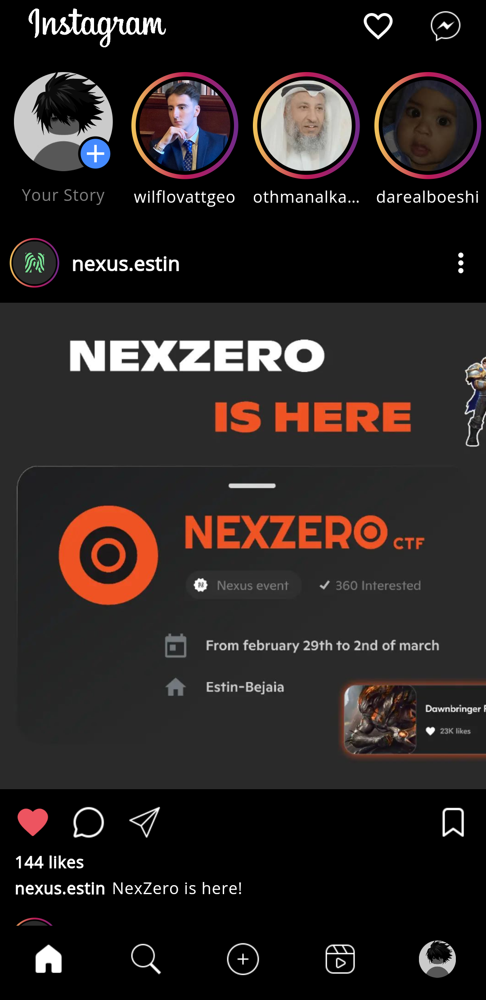

# instagram-clone

A simple static instagram UI that consists of two views: home and profile views.

## Screenshots

  
  

## To consider

* The project is not a fully functional Instagram clone. It has some basic data for my account. So if you don't have a problem with it, you can just work with all the images and icons in the assets folder, or alternatively provide another source of data.
* Run flutter pub get to install the two packages inside pubspec.yaml: google_fonts and splash_view.
